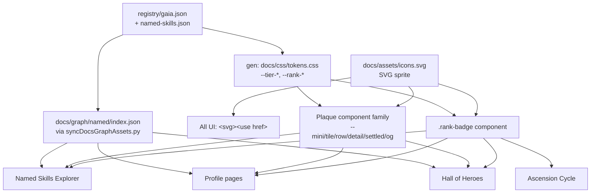

# Frontend Cohesion Overhaul — Hunter's Atlas

## Context

The public site has drifted out of one visual language. Concrete breakages confirmed in this session:

1. **Mono font silently never loads.** `docs/css/styles.css:6-13` declares `@font-face` for Departure Mono, but `docs/assets/fonts/DepartureMono-Regular.woff2` doesn't exist (the `docs/assets/` directory only has `marks/`). The next fallback `JetBrains Mono` isn't loaded anywhere either. Every "HUD / code" element designed for Departure Mono is silently rendering as system mono.
2. **Plaque profile pages have a different font loadout than the rest.** `scripts/generateProfilePages.py:262-264` loads Google Fonts via a hardcoded `<link>` for `EB Garamond` + `Bricolage Grotesque` only — no mono, no `ui.js` script — while `docs/index.html` loads them via `@import` in `styles.css:1`. Terminal-style text on `/u/<handle>/` pages renders differently from the same text on the home page.
3. **Inline SVG icons duplicated everywhere.** Diamond-seal SVG is inlined at least 6× (`generateProfilePages.py:111, 187, 212` alone — and `EB Garamond` is spelled two different ways across them). The "copy" icon has **five** variants: `CLIP` (`ui.js:8`, 14×14), `CLIP_SM` (`named-skills.js:36`, 13×13), a second `CLIP_SM` (`skill-explorer.js:623`, 13×13), `COPY_ICON` (`skill-explorer.js:163`, 15×15), plus inline `usp-copy` SVG in `docs/index.html`. On top of that, the explorer hero install row at `skill-explorer.js:115` uses the literal text **"Copy"** with no icon. GitHub octocat SVG inlined 3×. Search-icon SVG repeated 3×.
4. **Rank rendering is inconsistent across 7+ surfaces.** Same level data renders as `.plaque-star` 6-star row, `.hoh-star` 6-star row, `.asc-tier--N` colored single chip, `.fn-level` flow chip, `.ns-level-badge` tile chip, `.se-badge` explorer hero chip, `.ult-level` claim row chip. Sizes, colors, and "stars vs. chip vs. text" are unpredictable.
5. **"One schema source of truth" rule is broken.** `docs/js/named-skills.js:219-235` ships a hardcoded `FALLBACK_NAMED_INDEX` that duplicates `registry/named-skills.json`. Tier hex codes (`#38bdf8`, `#c084fc`, `#f59e0b`, `#7c3aed`) and rank hex codes are hardcoded in 6+ JS/CSS files even though `registry/gaia.json.meta.typeColors` and `meta.levelColors` already declare them with `bg`/`border` companions (verified at `gaia.json:5-90`).
6. **Field view / 3D registry vocabulary alignment.** The user-facing toggle is locked to `⇄ Field view` per `CONTEXT.md:137-139` (Stage 0 update; `DESIGN.md:149, 297` now match). `docs/index.html:52` already ships `⇄ Field view` on `.field-trigger` (correct). `docs/js/hud-toggle.js:14` toggles `⇄ Exit field` / `⇄ Field view` (correct). The drift to clean up: `docs/css/styles.css` carries **both** dead `.hud-trigger` rules (173-184) and live `.field-trigger` rules (187-207) — fold these into one block where `.field-trigger` is canonical and `.hud-trigger` is either deleted or kept only as an internal-code-class synonym per CONTEXT.md's pragmatic note.
7. **Three plaque variants render different field sets** for the same skill: HoH `.plaque--mini` skips description+tags; explorer `.plaque--tile` shows them with an install row; profile `.plaque--settled` shows them with an evidence chip + gold underline. A user can't recognize them as the same vocabulary.
8. **Mobile breakpoints are ad-hoc.** Active in styles.css: `360`, `400`, `480`, `600`, `700`, `768`. No canonical set.

Goal: rebuild a single visual vocabulary — icons, ranks, plaques, fonts, breakpoints — fed from one schema source (`registry/gaia.json` + `registry/named-skills.json`), with a committed sampler page per stage so each refinement is reviewable.

**Branch:** `dev/frontend-cohesion-overhaul` (unrestricted scope per `CLAUDE.md` branch table).

**Hermes-owned files (do not touch):** `STEWARDSHIP_PLAN.md`, `scripts/marketing_engine.py`, `scripts/email_sender.py`, `scripts/share_deliverable.py`, `scripts/generate_adoption_dashboard.py`, `scripts/generate_showcase.py`, `docs/ADOPTION.html`, `docs/SHOWCASE.html`, `docs/WHY-GAIA.md`, `docs/QUICKSTART.md`.

## Shape



Every stage commits one `docs/samples/<stage>.html` page that loads real schema data, so review is click-through, not screenshot.

## UX Wireframes (target state)

### Home (`/`)

```
┌─────────────────────────────────────────────────────────────┐
│ ◇G  Gaia        Codex · Named · How we do · GitHub ⇄ HUD    │ <- nav: hairline border, no glass
├─────────────────────────────────────────────────────────────┤
│                                                             │
│   GAIA · The Hunter's Atlas                                 │ <- EB Garamond 600 hero, gold underline accent
│   Evidence-class registry of agent skills. Earn rank.       │
│                                                             │
│   [◆ Open full graph]   [⇄ Field view]                      │ <- only place tier-gradient pill is allowed
│                                                             │
│   ┌──────── Ascension Cycle ────────┐                       │
│   │ 0★  1★  2★  3★  4★  5★  6★      │ <- all 7 use SAME rank-badge component
│   └────────────────────────────────┘                        │
│                                                             │
│   ┌──── Hall of Heroes (track) ────┐                        │
│   │ [plaque--mini] [plaque--mini]…│ <- mini variant of unified plaque
│   └────────────────────────────────┘                        │
│                                                             │
│   Named Skills Explorer  ▼filter type ▼filter rank          │
│   ┌─────────┐ ┌─────────┐ ┌─────────┐                       │
│   │ tile    │ │ tile    │ │ tile    │ <- plaque--tile (unified)
│   └─────────┘ └─────────┘ └─────────┘                       │
└─────────────────────────────────────────────────────────────┘
```

### Profile (`/u/<handle>/`)

```
┌─────────────────────────────────────────────────────────────┐
│ ◇G  Gaia                                  (same nav)        │ <- regenerated, NOW with mono + ui.js
├─────────────────────────────────────────────────────────────┤
│   @<handle>                                                 │ <- Honor Red, Bricolage
│   Hardened · 4★ ☆☆☆☆ ☆☆ ◆ Ultimate · 1                      │ <- rank-badge (chip+stars) reused
│                                                             │
│   ┌───── Owned Skills ─────┐                                │
│   │ [plaque--settled]      │ <- same fields & alignment
│   │ [plaque--settled]      │     as plaque--tile, with
│   │                        │     evidence-class chip + gold
│   └────────────────────────┘     underline as the only delta
└─────────────────────────────────────────────────────────────┘
```

### Explorer modal (`#skillExplorer` overlay, triggered from any plaque click)

```
┌──── Skill Explorer ───────────────────────────────  [×] ───┐
│                                                            │
│  ┌─────────────┐   <skill-name>                            │ <- plaque--detail two-column
│  │  orb 6★     │   [italic title, EB Garamond]             │
│  │ shimmering  │   @handle  · 4★ chip · tag tag tag         │
│  └─────────────┘   Description body (Bricolage 1rem/1.65)  │
│                                                            │
│  ┌── Installation ──┐                                      │
│  │ $ gaia install … [copy] │ <- sprite icon, not "Copy" text
│  │ $ npx skills add  [copy]│                              │
│  │ $ git clone …    [copy]│                              │
│  └──────────────────┘                                     │
│   [↗ Show on GitHub]                                       │ <- octocat sprite, not inline
└────────────────────────────────────────────────────────────┘
```

### Field view (`⇄ Field view` toggled on — internally known as HUD mode)

```
┌─────────────────────────────────────────────────────────────┐
│ ◇G  Gaia                                  ⇄ Exit field      │ <- toggle text matches CONTEXT.md:137-139
├─────────────────────────────────────────────────────────────┤
│                                                             │
│            (3D canvas takes over full viewport,             │
│             nav stays above; hero content fades)            │
│                                                             │
└─────────────────────────────────────────────────────────────┘
```

### Mobile (≤480 px) — explorer

```
┌─────────────────┐
│ ◇G ··· ☰        │ <- nav collapses, search icon
├─────────────────┤
│ Named Skills    │
│ [filter chips]  │ <- horizontal scroll, no glyph hex codes
│ ┌─────────────┐ │
│ │ plaque tile │ │ <- single column ≤480
│ └─────────────┘ │
│ ┌─────────────┐ │
│ │ plaque tile │ │
│ └─────────────┘ │
│ (no HUD btn)    │ <- toggle hidden under 700px
└─────────────────┘
```

## Stages

### Stage 0 — Domain glossary lock in `CONTEXT.md` (prerequisite for every other stage)

Every later stage references "the section is just called Basics," "the rank-name pill says Hardened, not 4★ Hardened," "Pure is a 0★ descriptor," etc. Those rules live in `CONTEXT.md` already (for the axes that are documented) but several terms used by the website, CLI, and tree generators are not yet pinned, and at least one banned synonym (`legendary`) still ships in production strings. Stage 0 closes the loop *before* any code or copy changes, so the rest of the plan can cite a single source.

`CONTEXT.md` today (`:7-52`) defines: `Basic / Extra / Unique / Ultimate` (tier taxonomy), `Stars` (the 0★–6★ axis name), `Rank` (a named label paired with a rank name — Hardened rank, Transcendent rank), `Evidence Class` (Class C/B/A), the seven rank names (Unawakened 0★ → Transcendent ★ 6★), `Rank up / Level up` verbs, `Demote`. Things `CONTEXT.md` does **not** yet pin and needs to:

- **"Pure"** as a 0★-rank descriptor — what it means, where it's used (per-skill pill in tree views, never as a section header), and what it does **not** mean (it doesn't mean "basic tier"; it doesn't mean "no upgrade chain"). The user's instruction: *"Pure is for 0 stars."*
- **"Basics"** as a section header — section labels carry the **tier name verbatim** (Basic skills, Extras, Uniques, Ultimates). Forbidden as section labels because they conflate axes: ~~"Unwired Basics"~~, ~~"Atomic Basics"~~, ~~"Pure / Undeveloped"~~, ~~"Atomic skills"~~.
- **"Atomic"** — if kept at all, only as an adjective for a *skill role* (an atomic skill has no prerequisites), never as a section label or tier synonym.
- **The four tier glyphs** as canonical and exclusive: `○` Basic, `◇` Extra, `◉` Unique, `◆` Ultimate. The Diamond Seal `◇G` is a separate brand mark (`CONTEXT.md:144`) and never replaces a tier glyph.
- **Direction & ordering rule** from Stage 4: catalogs sort Ultimate-first and read top-right → bottom-left; journeys read low-to-high left-to-right; Ascension Cycle is the sole documented journey.
- **Render-artifact names**, with exact spelling and capitalisation, so copy never drifts:
  - **Hunter's Atlas** — the public registry surface as a whole.
  - **Atlas** — short form of Hunter's Atlas (only in subheaders / nav).
  - **Registry** — the canonical 3D view button label and the data layer (`registry/gaia.json`); not a synonym for Atlas.
  - **Field view** — the user-facing label for the full-viewport overlay mode of the Registry (toggle: ⇄ Field view / ⇄ Exit field). "HUD" is internal-only (code class names like `.hud-trigger`, files like `hud-toggle.js`); never surface "HUD" in copy.
  - **Tree** — the markdown projection (`tree.md`, `skill-tree.md`); never used for the DAG view in the Named Skills Explorer (that's "Tree view" — qualified).
  - **Hall of Heroes** — the horizontal track on the home page.
  - **Ascension Cycle** — the 0★→6★ journey diagram on the home page (the only catalog-shaped surface that intentionally reads ascending).
  - **Codex** — `/codex.html`, the long-form reference.
  - **Named Skills Explorer** — the filterable browse surface on the home page with Tile / List / Tree view modes.
  - **Plaque** — every card-shaped skill render. Variants: `--mini` / `--tile` / `--row` / `--detail` / `--settled` / `--og`.
- **Verb table** (canonical actions, with the CLI-equivalent in parens): **Scan** (`gaia scan`), **Propose** (`gaia propose`), **Promote / Rank up / Level up** (`gaia promote`), **Demote** (no CLI verb yet), **Name** (`gaia push` lands a Named Skill), **Fuse** (`gaia fuse`), **Claim** (claim an Unclaimed Ultimate), **Install** (`gaia install`), **Open** (open the Registry / HUD / Tree).
- **Banned synonyms** (`_Avoid_` list, alphabetised so Stage 7 grep is easy): `Atomic Basics`, `Atomic skills` (as section label), `common`, `Highest Tier: common`, `legendary`, `legendary skill`, `mythic`, `Pure / Undeveloped`, `singularities`, `top-tier skill`, `Undeveloped`, `Unwired Basics`. Plus axis-confusion: using `rank` / `level` / `tier` alone to mean the *stars axis*.

**Edits in this stage:**
- **Edit** `CONTEXT.md:29-52` — append the **Pure** entry under "Maturity (the level)": `**Pure**: alternative descriptor for the Unawakened (0★) rank. Used only as a per-skill pill, never as a section or category label. _Avoid_: "Pure skill" as a tier synonym; "Pure / Undeveloped" as a section header (conflates the tier and stars axes).`
- **Edit** `CONTEXT.md:7-28` — add a one-line clarification under each tier entry that the **section header** in any catalog is the tier name itself ("Basics", "Extras", "Uniques", "Ultimates").
- **Edit** `CONTEXT.md:175-188` ("Artifacts" section) — extend with the artifact-name table above. Pin the spelling of HUD, Tree, Atlas, Registry, Hall of Heroes, Ascension Cycle, Codex, Named Skills Explorer, Plaque.
- **Edit** `CONTEXT.md:189-…` ("Verbs (use in copy)") — extend with the verb table above; each verb gets the CLI equivalent.
- **Append** a new `## Banned synonyms` section at the end of `CONTEXT.md` — alphabetised single-column list. Stage 7's CI grep cites this section by name.
- **Verify** `DESIGN.md` and `CLAUDE.md` do not contradict the glossary; flag any drift back to the user before Stage 1 starts.

**Acceptance:**
1. `grep -c 'Pure' CONTEXT.md` ≥ 1, with the definition pinned to "alternative descriptor for the Unawakened (0★) rank."
2. The `## Banned synonyms` section exists and includes every term in the table above.
3. Every later stage's section headers (Basics / Extras / Uniques / Ultimates) match `CONTEXT.md` verbatim.
4. **Reviewer signoff:** before Stage 1 begins, post the diff of `CONTEXT.md` and confirm the glossary is final — every later stage cites it.

### Stage 1 — Foundation: fonts, icon sprite, schema-driven tokens

**Sampler:** `docs/samples/foundation.html` — every icon × every state, every tier swatch, every rank swatch, all three font stacks side-by-side. A `<code>` block on the same page verifies Departure Mono actually loads.

- **New** `docs/assets/fonts/DepartureMono-Regular.woff2` (vendored OFL binary from departuremono.com; `DepartureMono-LICENSE.txt` adjacent).
- **New** `docs/assets/icons.svg` — single SVG sprite with `<symbol id="…">` for: `seal-diamond`, `seal-diamond-wordmark`, `copy`, `copy-check`, `github`, `search`, `share`, `arrow-back`, `arrow-up`, `close-x`, `lock`, `sparkle`, `claim-arrow`, `hud-toggle`, `external-link`, `chevron-down`, `tier-glyph-basic`, `tier-glyph-extra`, `tier-glyph-unique`, `tier-glyph-ultimate`.
- **New** `scripts/generateCssTokens.py` → writes `docs/css/tokens.css` from `registry/gaia.json.meta`. Emits `:root { --tier-basic, --tier-basic-rgb, …, --rank-0, --rank-0-bg, --rank-0-border, … --rank-6 }`. Hook into `scripts/syncDocsGraphAssets.py` so it ships with every registry update; also call from `scripts/build_docs.py --check`.
- **Edit** `docs/css/styles.css:1` — remove the `@import`. Move font loading to explicit `<link rel="preconnect">` + `<link rel="stylesheet">` in every HTML head (and the generated profile head). Add JetBrains Mono Google Fonts as second mono fallback (something OFL renders even if the woff2 ever goes missing again).
- **Edit** `docs/css/styles.css:6-13` — drop the TODO comment; `src` now points at a real file.
- **Edit** `docs/index.html`, `docs/codex.html`, `docs/how-we-do-things.html` — replace every inline icon SVG with `<svg class="ico"><use href="assets/icons.svg#<id>"/></svg>`. Replace every inline diamond-seal with the seal sprite. Identical font `<link>` block (EB Garamond + Bricolage + JetBrains Mono + the local Departure Mono `@font-face`).
- **Edit** `docs/js/ui.js:8`, `docs/js/named-skills.js:36-37`, `docs/js/skill-explorer.js:163, 623` — delete each inline-SVG string and import a shared `icon(id)` helper from new `docs/js/icons.js` (loaded before the other UI scripts).
- **Edit** `docs/js/skill-explorer.js:115` — replace the literal text `Copy` button with the sprite icon + flash-to-check state, matching the `.copy-btn` system from `ui.js`.
- **Edit** `scripts/generateProfilePages.py:109-112` (`DIAMOND_SEAL_SVG`), `:183-206` (`NAV_HTML`), `:208-221` (`FOOTER_HTML`), `:262-264` (font links) — replace inline SVG with `<use href="../../assets/icons.svg#…">` and align font links to the same `<link>` block (incl. JetBrains Mono). Add `<script src="../../js/ui.js">` and `<script src="../../js/icons.js">` to the generated head.
- **Defer-not-delete** `.hud-trigger` / `.field-trigger` rules (lines 173-207) — Stage 5 cleans them up; touching them here causes intermediate visual breakage.

Acceptance: open `foundation.html`; every icon renders; every tier/rank swatch matches `gaia.json.meta`; a `<code>` block visibly renders in Departure Mono (not system mono).

### Stage 2 — Rank badge unification

**Sampler:** `docs/samples/ranks.html` — every rank (0★–6★) rendered in every context (ascension cycle row, HoH mini-plaque, profile settled plaque, explorer detail hero, named-skills tile, flow node, unclaimed-Ultimate row, OG card) all on one page.

New primitive: `.rank-badge[data-level="N"][data-variant="chip|stars|full"]` with sub-elements `.rank-badge__chip` (colored level chip) and `.rank-badge__stars` (6-star row). Reads colors **only** from `--rank-N` / `--rank-N-bg` / `--rank-N-border` (Stage 1 tokens).

- **New** `docs/js/rank-badge.js` — exports `window.rankBadge(level, { variant })`.
- **Edit** `docs/css/styles.css` — replace `.asc-tier--1` … `--6` (≈2306-2311), `.hoh-star`/`.hoh-star--dim` (≈2266-2268), `.ult-stars .hoh-star`, `.fn-level`, `.ns-level-badge`, `.se-badge`, `.ult-level` with selectors keyed on `.rank-badge[data-level="N"]`. Drop per-level hex codes.
- **Edit** `docs/css/plaque.css:149-165` (`.plaque-stars`, `.plaque-star`, `.plaque-star--dim`) — fold into `.rank-badge__stars`. Gold/dim driven by `data-level`, not class presence.
- **Edit** call sites: `docs/js/page-ia.js:41-48` (`starsRow`), `docs/js/named-skills.js:75-76` (level chip span), `docs/js/skill-explorer.js:85-89` (badges array) + `:264` (`fn-level`), `scripts/generateProfilePages.py:100-106` (`build_stars`), `scripts/generateOgCards.py` (stars/chips).
- **Edit** `docs/index.html:262-303` — ascension cycle's `.asc-tier--N` spans → `<span class="rank-badge" data-level="N" data-variant="chip"></span>`.

Acceptance: open `ranks.html`. Rank 4★ on the HoH plate is pixel-identical in color/weight/letter-spacing to rank 4★ on the profile plaque, the explorer hero, the named-skills tile, and the ascension cycle row.

### Stage 3 — Plaque component family

**Sampler:** `docs/samples/plaques.html` — one skill (`karpathy/autoresearch`) rendered in all six plaque variants stacked, plus an "alignment grid" overlay toggle that draws baselines.

Variants (all share base `.plaque`):
- `.plaque--mini` — HoH track card: seal · slug · handle · rank stars only.
- `.plaque--tile` — explorer grid card: orb · level chip · slug · title · handle · description · tags · install row.
- `.plaque--row` — horizontal `--tile` for list view.
- `.plaque--detail` — explorer hero (modal): two-column.
- `.plaque--settled` — profile card: `--tile` plus rank stars, evidence-class chip, gold underline. The "trophy" variant.
- `.plaque--og` — 1200×630 social card (server-rendered by `generateOgCards.py`).

- **New** `docs/js/plaque.js` — exports `plaque.renderMini`, `renderTile`, `renderRow`, `renderDetail`, `renderSettled`. Shared field-set helpers (description, tags, handle row).
- **Edit** `docs/css/plaque.css` — collapse `.plaque-skill-name` / `.plaque-title` / `.plaque-description` / `.plaque-tag` / `.plaque-contributor` to CSS custom properties only. Replace `data-type="basic|extra|unique|ultimate"` color overrides (≈lines 109-114) with one rule using `var(--tier-<type>)`. Document each variant in a header block comment.
- **Edit** `docs/js/named-skills.js:65-86` (`renderTile`), `:88-130` (`renderListRow`) → call `plaque.renderTile`/`renderRow`.
- **Edit** `docs/js/page-ia.js` HoH mini-plate emit → `plaque.renderMini`.
- **Edit** `docs/js/skill-explorer.js:76-139` (`renderHero`) → `plaque.renderDetail`.
- **Edit** `scripts/generateProfilePages.py:115-162` (`build_plaque_card`) → emit the same `.plaque--settled` markup as the JS, so explorer modal and profile card stay visually inseparable except for variant chrome.
- **Edit** `scripts/generateOgCards.py` — Jinja template consuming the shared field set; emit `.plaque--og` markup.

Acceptance: open `plaques.html`. Same skill across six variants uses same skill-name color, same handle color (Honor Red), same italic serif title, same tag chip style. 6★ rainbow shimmer animation runs identically on every variant.

### Stage 4 — Named Skills Explorer overhaul + schema source-of-truth fix + view-mode coherence

**Sampler:** `docs/samples/explorer.html` — explorer renders in **all three view modes** (Tile / List / Tree) with unified plaques. Toolbar across the top to switch views and filters; identical filter/search state preserved across switches. Footer stamp shows loaded `version` + `generatedAt` from `gaia.json`.

#### View-mode wireframes (target state)

The same skill (`karpathy/autoresearch`, 6★, ultimate) renders in three modes — same fields, same hierarchy, just different geometry. Today they diverge on field selection, action affordances, and chip styling.

**Tile view** — grid of `.plaque--tile` cards. Density: full info per card.
```
┌─ Tile (≥481px: 2-col, ≥700px: auto-grid) ────────────────────┐
│ ┌──────────────────────────────┐ ┌──────────────────────────┐│
│ │ ◆orb  [6★]  ★origin  ↗gh    │ │ ◇orb  [3★]  ↗gh         ││
│ │ karpathy/autoresearch         │ │ glincker/readme-generator││ <- slug, EB Garamond italic
│ │ The Scholar's Compass         │ │ The Document Weaver      ││ <- title, Honor Red mono
│ │ @karpathy                     │ │ @glincker                ││ <- handle row, Bricolage
│ │ Autonomous research agent…    │ │ Analyzes a project's…    ││ <- description, 3 lines
│ │ #research #autonomous #paper  │ │ #docs #readme            ││ <- tags (max 3), token-color
│ │ ┌────────────────────────┐   │ │ ┌──────────────────┐     ││
│ │ │ $ gaia install karpathy/… │   │ │ $ gaia install … │     ││ <- install row, mono, copy sprite
│ │ └────────────────────────┘   │ │ └──────────────────┘     ││
│ └──────────────────────────────┘ └──────────────────────────┘│
└──────────────────────────────────────────────────────────────┘
```

**List view** — table-like rows of `.plaque--row`. Density: scan-friendly.
```
┌─ List ───────────────────────────────────────────────────────────────────────────┐
│ ◆· karpathy/autoresearch · The Scholar's Compass · @karpathy   #research #auto · [6★] · ↗gh ›│
│ ◇· glincker/readme-generator · The Document Weaver · @glincker #docs #readme   · [3★] · ↗gh ›│
│ ○· addy-osmani/test-driven-development · The Red-Green Oath · @addy-osmani #tdd · [2★] · ↗gh ›│
└──────────────────────────────────────────────────────────────────────────────────┘
```
Same field set as Tile (slug, title, handle, tags, level, GitHub) — just laid out horizontally. Description and install row collapse into a hover-revealed tooltip / a click-through. **No silent field drops.**

**Tree view** — layered DAG; nodes are `.plaque--mini`. Density: spatial, prerequisite-relationship-first. **Ultimates anchor top-right, basics flow down-left.**
```
┌─ Tree (Ultimate at top-right; prerequisites cascade down + left) ────────┐
│                                              ◆ karpathy/autoresearch [6★]│ <- Ultimate, top-right
│                                             /            |               │
│                                            /             |               │
│                              ◇ /knowledge-harvest [4★]   ◇ /ghostwrite [4★]│ <- Extra, depth-1
│                              /            |              \               │
│                             /             |               \              │
│                       ◇ /research [3★]   ◇ /web-scrape [3★]              │ <- Extra, depth-2
│                       /        |        \         |                      │
│                      /         |         \        |                      │
│ ○ /web-search [1★]  ○ /summarize [0★]  ○ /cite-sources [1★] …            │ <- Basic, bottom-left
└──────────────────────────────────────────────────────────────────────────┘
```
- **Layout direction:** Ultimate anchors **top-right** of its subtree. Each prerequisite renders one step **down and left** of its dependent. Basics live at the bottom-left edge of the canvas. Reading flow: top-right → bottom-left, matching the "trophy → ingredients" mental model already used by the markdown `tree.md` (Ultimate-first sections).
- **Iteration order in code:** `renderFlowchartView` (named-skills.js:148) currently iterates `ranks[0…maxD]` top-to-bottom (basics first). **Flip to `ranks[maxD…0]`** so ultimates render at the top of the DOM as well as visually. Within each rank, sort cards by `type` descending (`ultimate > unique > extra > basic`) then by `level` descending — matches `TYPE_ORDER` already used by Tile/List.
- **Edge direction:** arrows point **from prerequisite to dependent** (visually: from down-left to up-right), reinforcing the "ascending toward Ultimate" reading direction. Ghost cards (no named implementation yet) get a hatched border, `--muted` text, no GitHub icon.
- Mini cards show: orb · slug · level chip · GitHub icon. Click → opens explorer modal (same `.plaque--detail` as the other views), so the field-set is *available*, just not on the canvas. Curved arrows colored by **prerequisite-edge token** (Stage 5: `--rank-N-edge`). Pan/zoom + minimap.

#### Confirmed view-mode inconsistencies (`docs/js/named-skills.js`)

- **Field-set drift:** Tile (`:65-86`) shows orb+level+origin+gh+slug+title+contributor+description+3 tags+install. List (`:88-105`) drops origin star, description, and install row, and limits tags to **2** (silent content cut). Tree (`:107-205`) drops everything except orb+slug+level chip+gh. **Fix:** define a single `viewFields(mode)` helper returning the field manifest per mode; the three render functions consume it. Document the rationale (List = scan-density; Tree = spatial-density) in a header comment.
- **Origin star** (`★`, line 76) only appears in Tile. Add to List (right-aligned next to level chip); skip in Tree (no room). Use the Stage 1 sprite (`#origin-star`), not the literal `★` glyph — currently it's an inline character that doesn't pick up `--apex-gold`.
- **GitHub link position drifts:** Tile = top-right of header; List = right of level chip; Tree = top-right of mini card. Lock to **right-edge of the card frame** in all three (driven by `.plaque > .plaque-actions` slot in Stage 3).
- **Inline `style="color:…;background:…;border-color:…"`** on `.plaque-level-chip` at lines 75 (Tile), 101 (List), 170 (Tree). Stage 2 deletes these in favor of `<span class="rank-badge" data-level="N">` — make sure all three render paths flip to `rankBadge(level, { variant: 'chip' })`.
- **Tile glow shadows** (`.ns-tile[data-level=…][data-type=…]` ≈1191-1215) are **richer** than List shadows (≈1217-1222), making the same skill feel more important in Tile. Decision: glow lives on the **plaque base**, not on the view-mode wrapper. `.plaque[data-level][data-type]` carries the rule once; `.plaque--row` and `.plaque--mini` reduce it proportionally (50% / 25% glow intensity via a CSS custom-property multiplier).
- **`.ns-list-row .ns-lr-arrow` (`›`)** at line 103 is the only "this row is clickable" affordance. Tile cards are clickable but show no arrow. Tree cards are clickable but show no arrow. **Fix:** drop the arrow from List entirely (the row hover state already implies clickability), or add a `.plaque-affordance` slot that all three modes use.
- **Tree-view `data-rank="N"`** at line 149 (a depth tier number, 0..maxD) collides semantically with the **rank-star system** (rank = level, 0★..6★). Rename to `data-depth` so a future stylesheet rule on `[data-rank]` doesn't accidentally hit DAG layers.
- **Tree-view arrow color** is set inline at line 146: `style="color:var(--muted)"`. Move to a class `.ns-dag-arrow` rule. After Stage 5's `--rank-N-edge` tokens land, color the arrow by the **target node's rank** (so prerequisite chains visually trace the rank progression).
- **Type-tab glyphs** at `index.html:316-321` are inline-styled hex (`<span style="color:#38bdf8;font-weight:800">○</span>` etc.). Replace with `<span class="tier-glyph" data-type="basic">○</span>` reading from `--tier-basic`. Same swap for the four tier tabs.
- **Level filter tabs `.ns-tab[data-level="N★"]`** (styles.css ≈1144-1161) duplicate per-rank gradient backgrounds in hex. Stage 2 token swap covers this — but also: visually they look like rank-badges. Decision: **the level tab IS a rank-badge** in `chip` variant + a tab-affordance underline. Reuse `<span class="rank-badge" data-level="N" data-variant="chip">` inside the `<button class="ns-tab">` so a "filter by 4★" tab and a "this skill is 4★" chip render identically — confirming to the user that the filter targets that exact chip color elsewhere on the page.
- **Sort dropdown** (`index.html` ≈ `<select id="nsSort">`) uses HTML entities for glyphs (`&#8597; Level`, `&#128100; Creator`, `A&#8211;Z`). Replace with the Stage 1 sprite (`#sort-arrows`, `#user`, `#alpha-asc`) inside `<option>` is impossible — instead, replace the `<select>` with a custom dropdown menu that uses sprite icons.
- **View-toggle buttons** in `index.html` (≈345-358) carry inline SVG that duplicates the tile / list / tree icons that should live in the Stage 1 sprite. Replace with `<svg><use href="assets/icons.svg#view-tile">` etc. Add `view-tile` / `view-list` / `view-tree` to the Stage 1 sprite manifest.

#### Direction & ordering rule (cross-surface)

**The rule:** every **catalog** (a list/grid/tree of skills the user is browsing or selecting from) sorts **Ultimate first** and reads **top-right → bottom-left** when laid out spatially. Tier sort precedes rank sort: `ultimate → unique → extra → basic`, then within each tier `6★ → 0★` descending.

**The exemption:** **journeys** (temporal/progression narratives) keep their natural ascending direction because the user is meant to read them as "starting point → goal." The Ascension Cycle is the canonical journey (`0★ → 6★`, left-to-right ascending) and stays as-is.

**Surface audit:**

| Surface | Current direction | Target | Action |
|---|---|---|---|
| Named Skills Explorer · Tile (`named-skills.js:355` `TYPE_ORDER`) | ✅ ultimate→basic groups | ✅ same | Add **descending level sort within each group** — currently `sortMode='level'` falls through and does nothing (`:343-344` only handles `creator` and `name`). |
| Named Skills Explorer · List | ✅ ultimate→basic groups | ✅ same | Same fix as Tile (level sort within group is a silent no-op). |
| Named Skills Explorer · Tree (`named-skills.js:148`) | ❌ basics at top, ultimates at bottom | Ultimate top-right | Iterate `ranks[maxD…0]` instead of `0…maxD`; mirror per the wireframe above. |
| Filter tabs (`index.html:317-321`) | basic → extra → unique → ultimate left-to-right (ascending) | ultimate → unique → extra → basic | Reorder DOM so the first hover/keyboard-focus target is the most-prestigious tier; keep `All` left of the four. |
| Sort dropdown (`#nsSort`) default | `level` (no-op) | **`level-desc`** (Ultimate-first within group) | Add `level-desc` (default), `level-asc` (rare; useful for "what's the easiest unlocked skill?"), keep `creator`, `name`. |
| Hall of Heroes track (`page-ia.js`) | check current sort | Ultimate first, left-to-right | Audit & flip if needed; the leftmost plate is the most-prestigious. |
| Profile · Owned Skills (`generateProfilePages.py:115-162`) | check current sort | Ultimate first, top-down | Audit & flip if needed. |
| 3D Registry · scatter strip (`styles.css:777-778` `.graph-scatter-edge--top` is `rgba(56,189,248,…)` = Basic, `--bot` is `rgba(192,132,252,…)` = Extra) | ❌ Basic at top, Extra at bottom | Ultimate at top, Basic at bottom | Stage 5 swap: `--top` = `--tier-ultimate`, `--bot` = `--tier-basic`. Strip currently shows two tiers; consider extending to all four with a four-stop gradient (ultimate top → unique → extra → basic bottom). |
| `tree.md` / per-user `skill-tree.md` (`generateProjections.py:_sorted_ultimates`) | ✅ Ultimate first, then Unique, then Pure Basics | ✅ same | No change. (This is Stage 5b's reference order — the rest of the site catches up to it.) |
| Ascension Cycle (`index.html:262-301`) | 0★ → 6★ left-to-right ascending | ✅ same (journey, exempt) | No change. Add a `data-pattern="journey"` attribute to document the exemption so a future linter doesn't auto-flip it. |
| `gaia tree` CLI (`treeManager.py`) | check; expected Ultimate-first per `_sorted_ultimates` reuse | Ultimate first | Audit; flip if needed. Stage 5b's shared renderer already enforces this. |

**Lint guard:** add to Stage 7's CI check a directional grep — any new "level ascending" loop without a `data-pattern="journey"` annotation fails the build:
```
! grep -RnE 'levels?\.sort\(.*a\s*-\s*b|sortBy.*level.*asc' docs/js/ scripts/ --include='*.js' --include='*.py' \
   | grep -v 'data-pattern.*journey'
```

#### Schema source-of-truth (the original Stage 4 work)

- **Edit** `docs/js/named-skills.js:219-235` — **delete `FALLBACK_NAMED_INDEX` entirely.** Replace the `.catch(…)` on line 238 with an explicit empty state ("Registry index missing — run `python scripts/syncDocsGraphAssets.py`") that only renders on fetch failure.
- **Edit** `docs/js/named-skills.js` — delete the `LEVEL_META` / `TYPE_META_G` fallback dictionaries. Meta lives only in `gaia.json.meta`; absence = console error + empty grid.
- **Edit** `docs/css/styles.css` — grep-verify nothing references `.ns-tile`, `.ns-list-row`, `.ns-lr-*`, `.ns-fc-*`, `.ns-dag-*`, `.ns-tree-ref` (the dead selectors flagged TODO(phase-9) in `named-skills.js:60-64` at ≈1177-1197), then delete.
- **Edit** `docs/js/skill-explorer.js:78` — drop the hardcoded type-color ternary in favor of `getComputedStyle(root).getPropertyValue('--tier-' + type)`.
- **Edit** `scripts/build_docs.py` — extend `--check` to invoke `generateNamedIndex.py`, `syncDocsGraphAssets.py`, `generateCssTokens.py`, `generateProfilePages.py`, `generateOgCards.py` in check mode; surface drift between schema and committed assets.

Acceptance:
1. With `docs/graph/named/index.json` temporarily renamed away, the explorer shows the empty state cleanly; restore and reload, every named skill renders.
2. The same skill in Tile / List / Tree shows **the same level chip color**, **the same handle color** (Honor Red), **the same GitHub link position** (right-edge), and **the same hover state** (lift + glow at proportional intensity).
3. Switching views preserves search query, type filter, and rank filter.
4. The "filter by 4★" level tab is pixel-identical in chip area to the 4★ chip on a card.
5. **Direction rule holds:** in Tile, List, and Tree, the first card / row / top-right node is **the most-prestigious skill that matches the current filter** (Ultimate before Unique before Extra before Basic; within a tier, 6★ before 0★). The Ascension Cycle is the only catalog that reads ascending, and it carries `data-pattern="journey"`.
6. No hardcoded tier/rank hex codes survive in any file under `docs/js/` or `docs/css/plaque.css` (Stage 7 enforces via grep).

### Stage 5 — HUD / 3D Registry: full design coherence pass

The 3D Registry isn't a one-button toggle — it's the most interactive surface on the site (drag-orbit, zoom, hover-tooltips, node-pick → modal, scatter strip, collection panel, mobile-hint). It will also drive **local graphing** for personal skill trees, so its design language has to be production-grade and inherit from the Hunter's Atlas, not from its own pocket palette.

Confirmed drift in `docs/js/skill-graph.js`:
- `:6-9` ships a local `PALETTE` dict re-declaring tier hex/rgb that already lives in `gaia.json.meta.typeColors`.
- `:13-19` ships a local level dict re-declaring rank hex/bg that already lives in `gaia.json.meta.levelColors`.
- `:744` canvas labels render in **`Inter, system-ui, sans-serif`** — not the Hunter's Atlas body face (`Bricolage Grotesque`) and not the display face (`EB Garamond`).
- `:798, 803` tooltip HTML hardcodes `font-family:monospace`, `color:#ef4444`, `color:#64748b` — should be `var(--font-mono)`, `var(--honor-red)`, `var(--muted)`.
- `:203, 209` edge strokes hardcode `rgba(148,163,184,…)` — should reference a slate edge token.

Confirmed surrounding 3D chrome (each with its own selector + hex codes in `docs/css/styles.css`):
- `.nav-graph-trigger` (≈79-84), `.graph-trigger` / `.hud-trigger` / `.field-trigger` (≈173-207)
- `.graph-scatter-strip` / `.graph-scatter-edge--top/bot` / `.graph-scatter-track` / `.graph-scatter-title` (≈767-786)
- `.graph-bottom-bar` (≈792)
- `.graph-collection-panel` and the entire `.graph-collection-*` family (≈910-960)
- `.graph-mobile-hint` (`index.html:117-121`, CSS `.graph-mobile-hint*`)
- `#canvas3d` (115) and `#hero.transitioning-to-graph #canvas3d` (144)

**Sampler:** `docs/samples/registry-3d.html` — four panels on one page:
  1. **HUD off** — hero with 3D canvas as ambient parallax background.
  2. **HUD on** — full-screen 3D Registry with chrome (scatter strip, bottom bar, collection panel) visible.
  3. **Tooltip + node-pick** — hover state and click-through to plaque modal.
  4. **Mobile ≤700px** — static SVG fallback + dismissed mobile hint.

A second sampler `docs/samples/registry-3d-fonts.html` shows canvas-rendered labels at 8/10/12/14/16 px, in both hover and resting state, so the new font choice is verifiable at every zoom level.

#### Vocabulary + toggle (post-Stage 0)

Stage 0 locked the user-facing label as **`⇄ Field view`** per `CONTEXT.md:137-139`. The toggle text in `docs/index.html:52` and `docs/js/hud-toggle.js:14` is already correct and needs no rename. Stage 5 only cleans up the **CSS drift**:

- **Edit** `docs/css/styles.css:173-207` — collapse the dead `.hud-trigger` block (173-184) and live `.field-trigger` block (187-207) into one canonical `.field-trigger` rule, reading tokens not hex. Keep `.hud-trigger` as a `composes:`-style alias only if needed for backward compatibility with any external integration; otherwise delete the synonym class entirely.
- **Verify** `aria-label="Toggle field view"` stays — matches the locked copy.
- Accept `?field=1` URL param (not `?hud=1`) so Field view is linkable from social cards and from `/u/<handle>/` profile pages once we wire local graphs.

#### Canvas typography

- **Edit** `docs/js/skill-graph.js:744` — replace `Inter,system-ui,sans-serif` with the Hunter's Atlas body face. Use `getComputedStyle(document.body).fontFamily` (so it picks up `--font-body` = Bricolage) so a single token change in CSS propagates to canvas. For **contributor handles** (Named-skill labels) use Departure Mono (`--font-mono`) at the same size; for **tier labels** on Ultimate hero nodes use EB Garamond italic (`--font-display`) at +20% size — these three faces map to the same hierarchy the rest of the site uses (body / mono / display).
- **Add** a `canvasFont(role, sizePx)` helper near the top of `skill-graph.js` that returns the right `ctx.font` string per role (`body | handle | display`). Use it everywhere `ctx.font =` appears; future font changes happen in one place.
- **Hi-DPI text crispness check** — labels must measure with the current `devicePixelRatio` already in play (already handled by `pr.scale`, but verify in the sampler at 1×/2×/3×).

#### Canvas colors (tokens, not hex)

- **Edit** `docs/js/skill-graph.js:6-19` — **delete** the local `PALETTE` and `LEVEL_META` dicts. Replace with a single `getTokens()` call that reads `--tier-*` and `--rank-*` from `:root` (Stage 1 tokens) via `getComputedStyle`. Cache once on first call; invalidate on theme reload.
- **Edit** every `ctx.fillStyle = …` / `ctx.strokeStyle = …` with a hardcoded `rgba(148,163,184,…)`, `rgba(167,139,250,…)`, `rgba(124,58,237,…)`, `rgba(239,68,68,…)` — route through the cached token map. Specific call-out sites: edge strokes (≈203, 209), Unique node fill (≈549, 554), Named node fill (≈363), VI corona (≈384).
- **Edit** tooltip HTML emit (≈798, 803) — strip `style="color:#ef4444…font-family:monospace"`; emit class names `.gst-named-id` and `.gst-skill-id` that resolve to `var(--honor-red)` / `var(--muted)` and `var(--font-mono)` in CSS. Add those classes to `styles.css` alongside the existing `.gst-stat` / `.gst-dim`.
- **Edit** `styles.css` `.gst-stat` (≈318-319 inline) — the unique-count chip uses hardcoded `#7c3aed`; replace with `var(--tier-unique)`.

#### Canvas geometry & line weights (preserve DESIGN.md locks, audit consistency)

Per `DESIGN.md:92-111`, sphere radii (`ultimate:12.5 / extra:6.9 / basic:3.5`), edge widths (`1.55 / 0.92 px` default, `2.2 / 1.4 px` highlighted), and Level VI rendering are **locked**. Stage 5 does not change those values. It does:

- **Verify** `skill-graph.js` matches DESIGN.md numbers; flag any drift in a comment block at the top of the file and fix.
- **Add** a `LINE_WEIGHTS` and `NODE_RADII` const block at the top, sourced from these locked numbers, so the magic numbers are no longer scattered through `drawNode*` functions.
- **Add** `--rank-3-edge` / `--rank-4-edge` / etc. token derivatives so the highlighted-neighbor edge color picks up the rank of the hovered node (today it's a flat rgba).

#### 3D Registry chrome (CSS islands → design system)

- **Edit** `.graph-scatter-strip`, `.graph-scatter-edge--top/bot`, `.graph-scatter-track`, `.graph-scatter-title` (styles.css ≈767-786) — swap hardcoded `rgba(56,189,248,.55)`, `rgba(192,132,252,.45)` for `--tier-basic`/`--tier-extra` at the right alpha. Border/typography aligns with the Stage 3 plaque vocabulary (Bricolage 0.72rem mono numerals).
- **Edit** `.graph-bottom-bar` (≈792-…) — adopt nav typography (mono small caps for stats, Bricolage for labels). No glass; sits on `var(--bg)` with a hairline `var(--border)` top.
- **Edit** `.graph-collection-panel` and the entire `.graph-collection-*` family (≈910-960) — replace `#7dd3fc`, `#4ade80`, `#fca5a5`, `#ef4444`, `rgba(148,163,184,.15)` with tokens. Every collection card becomes a `.plaque--mini` (Stage 3) so the "saved skills" panel reads as the same vocabulary as Hall of Heroes. Copy buttons use the Stage 1 sprite, not text.
- **Edit** `.graph-mobile-hint` (`index.html:117-121`) — rebuild as a `.plaque--callout` using Stage 3 callout tokens; the `🖥️` emoji becomes a `<use href="icons.svg#monitor">` sprite icon (add to Stage 1 sprite manifest); copy stays.
- **Edit** `.nav-graph-trigger` (≈79-84) — align focus ring and color hierarchy with the other nav buttons so "Registry" doesn't read as a third-class link.

#### Local-graph readiness

Because this surface will also render **personal skill trees** (per `skill-trees/<user>/skill-tree.json`), the design has to scale beyond the public registry's dataset:

- **Add** a `graphMode` prop (`'public' | 'local'`) to the graph init. In local mode: nav title swaps to "@\<handle\> · Atlas", collection panel becomes "Claimed skills," the scatter strip pulls from the user's owned-skill counts. No new chrome — the same widgets repurpose.
- **Add** a documented `<canvas-tokens>` contract at the top of `skill-graph.js` listing every `--tier-*`/`--rank-*`/`--honor-red`/`--apex-gold`/`--muted` token the canvas reads. A local graph host page can override any token via `:root` and the canvas inherits cleanly.

#### Mobile

- **Edit** `docs/css/styles.css` mobile blocks (≈1032, 1822, 2402) — confirm `#canvas3d` is suppressed under 700px and the static `graph/gaia.svg` fallback shows. Hide the `.field-trigger` entirely on ≤700px (not actionable when canvas is suppressed). The scatter strip, bottom bar, and collection panel are also suppressed below 700px per current behavior — verify.

Acceptance:
1. `⇄ Field view` toggles into a true full-viewport overlay (internally HUD mode); mobile shows the static SVG hero with no toggle button. Toggle text matches CONTEXT.md exactly; no surface uses "HUD" in copy.
2. Hover a node: label renders in Bricolage; tooltip renders with mono handle in Honor Red, muted skill-id below it.
3. Open the collection panel: every saved skill is a `.plaque--mini`. The "copy all" and "clear all" buttons use sprite icons (not text), use token colors.
4. `! grep -nE '#(38bdf8|c084fc|f59e0b|7c3aed|fbbf24|ef4444|63cab7|a78bfa|e879f9|94a3b8|64748b|7dd3fc|4ade80|fca5a5)' docs/js/skill-graph.js` returns 0.
5. The `registry-3d-fonts.html` sampler shows readable labels at 8-16 px in Bricolage, mono handles in Departure Mono, Ultimate plate labels in EB Garamond italic.

### Stage 5b — Classic Tree (`tree.md` + per-user `skill-tree.md`): naming + coloring cohesion

The "Tree" in *Gaia Skill Tree* is the literal markdown/ASCII tree that ships at `docs/tree.md`, opens inside the explorer dialog (`#treeDialog`), downloads as `gaia-skill-tree.md`, and is mirrored per-user at `skill-trees/<handle>/skill-tree.md`. It's the single most-shared artifact (people post it in PRs, Discord, blogs) and right now it carries vocabulary and coloring that don't match anything else in the Atlas.

Confirmed inconsistencies:

**Naming drift (single source of truth: `scripts/generateProjections.py`):**
- `:576` reads "Upgrade paths — each **legendary** shows its full prerequisite chain." But "legendary" is already a banned synonym in `CONTEXT.md:23` (`_Avoid_: legendary skill, top-tier skill, mythic`). The schema word is **Ultimate**.
- `:619` "Pure / Undeveloped — basic skills not yet wired into any upgrade path." **Two violations:**
  - "Pure" is a **stars-axis** descriptor reserved for 0★ skills (the Unawakened rank), per the Stage 0 glossary entry. Using it as a section label for *all* basic-tier skills with no wiring conflates the **tier axis** (Basic/Extra/Unique/Ultimate) with the **stars axis** (0★–6★). A 3★ basic with no upgrade chain is "Basic" but not "Pure".
  - "Undeveloped" reads pejoratively; design language is positive ("Awakened", "Named", "Evolved"). Drop it.
  - **Replacement section header:** **"Basics"** — full stop, matches `CONTEXT.md` tier name verbatim. Skills 0★ in this section can carry a "Pure" rank-name pill inline (matching the per-rank pill used elsewhere), but the section name doesn't conflate the two axes.
- `:604` "Unique Skills — graph-isolated **singularities** at 4★+." "Singularities" is not in CONTEXT.md and doesn't appear anywhere else in the codebase. Replace with the literal schema definition: **"Unique Skills — standalone tier-IV+ skills with no prerequisites and no descendants."**
- `:591` Ultimate row prints `◆ <display>  [<level>]` (no "Ultimate Skill:" prefix) but `:614` Unique row prints `◉ Unique Skill: <display>` and `:629` Basic prints just `○ <display>`. **Asymmetric.** Either every row carries a "<Tier>: " prefix, or none does. Decision: **drop all "<Tier> Skill:" prefixes from `tree.md`** — the glyph already encodes tier (◆/◇/◉/○) per Stage 1 token map, and the section header already labels the group. Saves visual noise, matches the legend block we'll add at the top.
- Per-user `skill-tree.md` header (`generateProjections.py:464`): `**Highest Tier:** common` — **"common" is not a tier in this schema.** `get_tier_label(meta, highest_level)` is mapping a missing/empty `highestLevel` stat to a stale default. Fix: route through `meta.levelLabels` (Awakened/Named/Evolved/Hardened/Transcendent) or show `—` if no skills are unlocked.
- Per-user table header (`:471`) mixes `Class | Rank | Tier`: in this codebase `class` is unused, `type` is `basic|extra|unique|ultimate`, `rank` is `0★…6★`, and `tier-label` is the rank's name (`Awakened`…`Transcendent`). Replace columns with **`Skill | Type | Rank | Tier name | Source | Date`** — and rename "Unlocked In" → "Source" (the column holds repo sources, not tiers).
- Per-user upgrade-path glyphs use `· ` for unowned and `✓ ` for owned; canonical `tree.md` uses neither. Make this **explicit and documented**: a leading two-char marker column (`✓ ` / `  `) appears **only** in per-user mode; canonical mode has no marker column. Add a one-line legend at the top of each tree explaining the markers actually present.
- `[Unclaimed ✦]` (`get_demerit_suffix`) uses `✦` (sparkle) — not in the Atlas icon set. Replace with the **same convention as the explorer plaque** (Stage 3): show the rank chip as muted (`--muted`) and a Honor-Red `Unclaimed` label, no glyph. In the markdown projection: `  [5★ · Unclaimed]`.
- Shared-prereq marker `(↑ see above)` (`:577`) is fine; keep as-is but render in `--muted` italic in the highlighted view.

**Coloring drift (the dialog `<pre>` is monochrome today):**
- `docs/js/skill-explorer.js:737 highlightTree()` already wraps tokens in spans (`.tree-handle-contributor`, etc.) but the CSS for those classes doesn't read tokens — verify and route through `--tier-*`/`--rank-*` from Stage 1.
- Glyph tokens (`◆ ◇ ◉ ○`) and rank brackets (`[6★]`, `[3★ · Evolved]`) are not colored. Add highlighter regex matches:
  - `◆` → `--tier-ultimate`
  - `◇` → `--tier-extra`
  - `◉` → `--tier-unique`
  - `○` → `--tier-basic`
  - `[N★…]` → `--rank-N` for the digit, `--muted` for the bracket and the tier-label suffix
  - `✓` (per-user owned marker) → `--apex-gold`
  - `Unclaimed` → `--honor-red`
  - `(↑ see above)` → `--muted` italic
- The dialog `<pre>` (`styles.css:642`) currently uses default mono — switch to `var(--font-mono)` (Departure Mono once Stage 1 lands) so the dialog reads as the same surface as terminal cards.
- The downloadable file is plain markdown — no color. But the **GitHub-rendered preview** of the same file should still scan well: section headers, fenced code, table layout. The current generator already uses fenced ` ``` ` blocks; verify the rendered Markdown looks tidy on GitHub at `skill-trees/<handle>/skill-tree.md` (currently it does, so don't break).

**CLI parity (the `gaia tree` command renders to terminal):**
- `src/gaia_cli/formatting.py:41-48` declares `TIER_COLORS` and `RANK_COLORS` as hardcoded RGB tuples. `src/gaia_cli/cardRenderer.py:77-82` declares **a second copy** of the same tables. Two sources of truth for the same colors that *also* live in `registry/gaia.json.meta.typeColors`/`levelColors`.
- **Edit** `formatting.py:41-48` — derive `TIER_COLORS` and `RANK_COLORS` from `registry/gaia.json` at module load (parse `meta.typeColors` and `meta.levelColors`, hex → RGB tuple). Cache.
- **Edit** `cardRenderer.py:77-82` — delete the duplicate; `from gaia_cli.formatting import TIER_COLORS, RANK_COLORS` instead. (`cardRenderer.py:614, 683, 721` and `treeManager.py:113, 122, 141` already import from `cardRenderer`; flipping the source is a one-line change at each.)
- **Verify** `gaia tree` and `gaia tree --named` render with the **same** glyph→color mapping that the dialog uses (since both now read from `gaia.json.meta`). Add a short `gaia tree --check` self-test that prints all four tier glyphs + all seven rank chips.

**One render contract (canonical + per-user share a renderer):**

Today `_generate_tree` (≈538-638) and the per-user block (≈456-533) duplicate row-formatting logic with subtle drift (Ultimate prefix vs. no prefix, owned-marker vs. no-marker, demerit suffix vs. tier-label suffix). Refactor:

- **New** `scripts/_tree_renderer.py` (or extend `_atlas_helpers.py`) exposing `render_tree(skills, *, mode='canonical'|'user', owned_ids=None, named_map=None)`. Both call sites call this. Markers, headers, and section labels are arguments; the row-format function is single.
- **Edit** `scripts/generateProjections.py:436-438, 444-533, 538-638` — both branches funnel through the new renderer. Net: −60 LOC, no more drift surface.
- The same renderer powers a future `gaia tree --md` flag (CLI prints the same markdown the website ships).

**Sampler:** `docs/samples/tree.html` — three panels stacked:
  1. Canonical `tree.md` rendered in the dialog (with new highlighter colors).
  2. Per-user `skill-trees/gaiabot/skill-tree.md` rendered in the dialog.
  3. The same `tree.md` rendered as **plain markdown on GitHub** (screenshot in an iframe-like card) so we verify the unhighlighted version still scans cleanly.
A `<details>` block on the page diffs the section headers across the three modes.

**Files to edit:**
- `scripts/generateProjections.py` — `:464` stat label fix; `:471` table header fix; `:576-578, :604, :619` section-header copy; `:591, :614, :629` tier-prefix removal; route both branches through new renderer.
- `scripts/_tree_renderer.py` (new) — single render contract for canonical + user trees.
- `src/gaia_cli/formatting.py:41-48` — RANK/TIER colors load from `gaia.json.meta`.
- `src/gaia_cli/cardRenderer.py:77-82` — drop duplicate, import from `formatting`.
- `docs/js/skill-explorer.js:737` (`highlightTree`) — extend regex to color glyphs, ranks, owned markers, "Unclaimed", "(↑ see above)".
- `docs/css/styles.css:642-648` (`.tree-dialog-body pre`, `.tree-skeleton`) — `var(--font-mono)`; add `.tree-glyph-{ult,ext,uni,basic}`, `.tree-rank-{0..6}`, `.tree-owned`, `.tree-unclaimed`, `.tree-shared` classes that the highlighter emits, all reading Stage 1 tokens.
- Re-run `python scripts/generateProjections.py && python scripts/syncDocsGraphAssets.py` to regenerate `generated-output/tree.md` → `docs/tree.md` and every `skill-trees/*/skill-tree.md` with the new vocabulary.

Acceptance:
1. `docs/tree.md` and every `skill-trees/*/skill-tree.md` carry **the same section headers and glyph conventions**, differing only in: (a) per-user has the unlocked-skills table + owned markers, (b) per-user has Pending Combinations, (c) canonical has the legend.
2. The phrase "**legendary**", "**common**", "**Pure / Undeveloped**", "**singularities**", "**Highest Tier: common**", "**Class | Rank | Tier**", and "**[Unclaimed ✦]**" appear **0 times** across `docs/tree.md`, `skill-trees/*/skill-tree.md`, and `scripts/generateProjections.py`.
3. Open the tree dialog in a browser: glyphs and rank chips render in their token colors. `gaia tree` in a terminal renders the same colors. `cat docs/tree.md | head` is still readable monochrome (markdown view).
4. `! grep -nE 'TIER_COLORS\s*=\s*\{' src/gaia_cli/cardRenderer.py` returns 0 (single source of truth).
5. Both `_generate_tree` and the per-user generator block are ≤15 lines each — the formatting moved to `scripts/_tree_renderer.py`.

### Stage 6 — Mobile breakpoint canonicalization

**Sampler:** `docs/samples/mobile.html` — three iframes (360, 480, 700 px) loading home, explorer, profile, codex pages.

Canonical breakpoints: **360 / 480 / 700**. Drop 400, 600, 768.

- **Edit** `docs/css/styles.css` — collapse `@media(min-width:400px)` (≈1116) and `@media(min-width:600px)` (≈1119) inside Skill Explorer into one `@media(min-width:480px)`; `@media(max-width:768px)` (≈1747) → 700. Keep `@media(max-width:360px)` (≈1812). Audit every other media query against the canonical set.
- **Edit** `docs/css/plaque.css` — three-breakpoint set for `.plaque-grid`, `.plaque--tile`, `.plaque--detail`. Single column ≤480, two-column 481-700, auto-grid above.
- **Verify** profile pages — `<nav>` collapses to hamburger sheet ≤700, search input doesn't overflow.
- **Verify** OG card (1200×630) is fixed-width — no breakpoint impact expected.

Acceptance: resize through 360/480/700/1024; no horizontal scroll at any width; no text clips out of plaques; explorer filter row collapses gracefully.

### Stage 7 — Cleanup, verification, samples landing

**Sampler:** `docs/samples/index.html` — landing page linking every stage sampler, one-line description + thumbnail each.

- **Delete** every legacy CSS selector marked dead in earlier stages; grep-verify zero remaining usage.
- **Delete** `FALLBACK_NAMED_INDEX` (already gone Stage 4; final verify), every remaining inline SVG icon string in JS.
- **CI guard A — color tokens:** add to `.github/workflows/branch-scope.yml` (or the docs CI job): `! grep -RE '#(38bdf8|c084fc|f59e0b|7c3aed|fbbf24|94a3b8|63cab7|a78bfa|e879f9)' docs/js/ docs/css/plaque.css scripts/generate*.py` (with `scripts/marketing_engine.py` etc. excluded — Hermes-owned).
- **CI guard B — banned synonyms from `CONTEXT.md` Stage 0:** `! grep -RnE '\b(legendary|Pure / Undeveloped|Unwired Basics|Atomic Basics|graph-isolated singularities|Highest Tier:\s*common|top-tier skill|mythic|Undeveloped)\b' docs/ scripts/generate*.py src/gaia_cli/` (with Hermes-owned files excluded).
- **CI guard C — direction rule:** the directional grep from Stage 4 (`! grep -RnE 'levels?\.sort\(.*a\s*-\s*b|sortBy.*level.*asc' docs/js/ scripts/` excluding `data-pattern="journey"`).
- Run the full pipeline: `python scripts/generateNamedIndex.py && python scripts/generateCssTokens.py && python scripts/syncDocsGraphAssets.py && python scripts/generateProfilePages.py && python scripts/generateOgCards.py && python scripts/build_docs.py --check`. Commit any regenerated artifacts.
- Run tests: `python -m pytest`, `cd packages/cli-npm && npm test`, `cd packages/mcp && npm run build && npm test`.
- Walk the docs site locally (`python -m http.server -d docs 8000`): home → HoH plate → explorer modal → "Show on GitHub" → back → profile page → ascension row → HUD toggle → Codex page. Verify every icon, font, and rank chip reads as the same system.

## Files at a glance

| File | Stage | Why |
|---|---|---|
| `CONTEXT.md` | 0 | Add **Pure** (0★ descriptor), section-header rule, artifact-name table, verb table, Banned-synonyms section — single source of truth for domain jargon |
| `docs/assets/icons.svg` (new) | 1 | Single source of truth for every icon |
| `docs/assets/fonts/DepartureMono-Regular.woff2` (new) | 1 | Make `--font-mono` actually load |
| `docs/css/tokens.css` (new, generated) | 1 | Schema-driven CSS custom props |
| `docs/css/styles.css` | 1, 2, 4, 5, 6, 7 | Strip dead selectors, swap inline hex for tokens, fix breakpoints, fix HUD class names |
| `docs/css/plaque.css` | 2, 3, 6 | Plaque family + rank-badge component |
| `docs/index.html` | 1, 4, 5 | Icons via `<use>`, ascension cycle uses `.rank-badge`, HUD wording |
| `docs/codex.html`, `docs/how-we-do-things.html` | 1 | Match font + icon loadout |
| `docs/u/*/index.html` (regenerated) | 1, 3 | Same fonts, scripts, plaque markup as main |
| `docs/js/icons.js` (new) | 1 | Shared `icon(id)` helper |
| `docs/js/rank-badge.js` (new) | 2 | Shared rank rendering |
| `docs/js/plaque.js` (new) | 3 | Shared plaque rendering |
| `docs/js/named-skills.js` | 1, 3, 4 | Drop FALLBACK, use shared plaque + icons, use tokens |
| `docs/js/skill-explorer.js` | 1, 2, 3, 4 | Use shared helpers; replace "Copy" text with icon |
| `docs/js/page-ia.js` | 2, 3 | HoH renders via shared plaque + rank-badge |
| `docs/js/hud-toggle.js` | 5 | (No copy rename — `⇄ Field view` is locked per CONTEXT.md.) Verify only; file name kept as `hud-toggle.js` is fine since "HUD" is internal-only. |
| `docs/js/skill-graph.js` | 5 | Delete local PALETTE/LEVEL dicts; route canvas fills + fonts through tokens; add `canvasFont(role,size)` helper; emit class-named tooltip HTML; prep `graphMode` for local trees |
| `scripts/generateProjections.py` | 5b | Single render contract for canonical + per-user trees; fix vocab (`legendary`, `common`, `Pure / Undeveloped`, `singularities`, `[Unclaimed ✦]`, `Class\|Rank\|Tier` table) |
| `scripts/_tree_renderer.py` (new) | 5b | Shared markdown-tree renderer (`mode='canonical'\|'user'`) used by both branches; future `gaia tree --md` |
| `src/gaia_cli/formatting.py` | 5b | `TIER_COLORS`/`RANK_COLORS` derive from `gaia.json.meta` at module load |
| `src/gaia_cli/cardRenderer.py` | 5b | Drop the duplicate `TIER_COLORS`/`RANK_COLORS`; import from `formatting` |
| `docs/js/skill-explorer.js` (`highlightTree`) | 5b | Highlighter regex extends to color glyphs, ranks, owned markers, "Unclaimed", "(↑ see above)" |
| `docs/css/styles.css` (.tree-dialog-body, .tree-glyph-*, .tree-rank-*, .tree-owned, .tree-unclaimed, .tree-shared) | 5b | Tree dialog uses `--font-mono`; new highlighter classes pull Stage 1 tokens |
| `scripts/generateProfilePages.py` | 1, 3 | Align fonts/scripts/markup with main; load `ui.js` + `icons.js` |
| `scripts/generateOgCards.py` | 2, 3 | `.plaque--og` from shared field set |
| `scripts/generateCssTokens.py` (new) | 1 | Emit `tokens.css` from `gaia.json.meta` |
| `scripts/syncDocsGraphAssets.py` | 1, 4 | Run tokens generation; surface drift |
| `scripts/build_docs.py` | 4, 7 | Add `--check` mode for full asset pipeline |

Existing utilities to reuse (do **not** duplicate):
- `docs/js/atlas-helpers.js` — already exposes `namedSlug`, `profileHref`, `handleLink`. Stage 3 keeps these as the only handle-link emitters.
- `scripts/_atlas_helpers.py` — Python equivalent; already imported by `generateProfilePages.py:38`. Stage 3 keeps using it.
- `registry/gaia.json.meta` — already provides `typeColors`, `typeSymbols`, `typeLabels`, `levelColors`, `levelLabels`, `demeritLabels`. Stage 1 makes this the **only** source of color truth.

## Sampler review checkpoints

After each stage, post the sampler URL for review before moving to the next:
- Stage 0 → diff of `CONTEXT.md` (no sampler — text-only glossary lock)
- Stage 1 → `docs/samples/foundation.html`
- Stage 2 → `docs/samples/ranks.html`
- Stage 3 → `docs/samples/plaques.html`
- Stage 4 → `docs/samples/explorer.html`
- Stage 5 → `docs/samples/registry-3d.html` + `docs/samples/registry-3d-fonts.html`
- Stage 5b → `docs/samples/tree.html`
- Stage 6 → `docs/samples/mobile.html`
- Stage 7 → `docs/samples/index.html` (landing)

## Verification (end-to-end)

1. **Schema drift check:** delete `docs/graph/`, `docs/css/tokens.css`, `docs/u/*`, `docs/og/*`. Re-run all generators. `git diff --quiet` must pass — generators are reproducible.
2. **Token-only enforcement:** `! grep -RE '#(38bdf8|c084fc|f59e0b|7c3aed|fbbf24|94a3b8|63cab7|a78bfa|e879f9)' docs/js/ docs/css/plaque.css` returns 0. Also `! grep -nE 'TIER_COLORS\s*=\s*\{|RANK_COLORS\s*=\s*\{' src/gaia_cli/cardRenderer.py` returns 0 (single source of truth for terminal colors).
3. **Tree vocabulary check (banned synonyms from `CONTEXT.md`):** `! grep -nE 'legendary|Pure / Undeveloped|Unwired Basics|Atomic Basics|graph-isolated singularities|Highest Tier:\s*common|\[Unclaimed ✦\]|^\| Skill \| Class \| Rank \| Tier \|' docs/tree.md skill-trees/*/skill-tree.md scripts/generateProjections.py docs/*.html docs/js/ docs/css/` returns 0. Same grep against `CONTEXT.md`'s `## Banned synonyms` section — should be in sync.
4. **Explorer view parity:** open `/`, switch Tile → List → Tree on the same skill; level chip color, handle color, and GitHub link position are identical across modes.
5. **Visual walk:** `python -m http.server -d docs 8000`, click through every sampler, then the live surfaces: `/`, `/codex.html`, `/u/karpathy/`, `/u/anthropic/`, explorer modal triggered from HoH, unnamed-skill popup, tree dialog (`#treeDialog`).
6. **Build/tests:** `python -m pytest`, `cd packages/cli-npm && npm test`, `cd packages/mcp && npm run build && npm test`, `python scripts/build_docs.py --check`.
7. **Mobile smoke:** DevTools narrow to 360px; no horizontal scroll; tap targets ≥44px on every button/icon; HUD toggle hidden.
8. **OG card check:** `docs/og/karpathy/autoresearch.png` regenerates with the new plaque variant; visually inspect diff is intentional.
